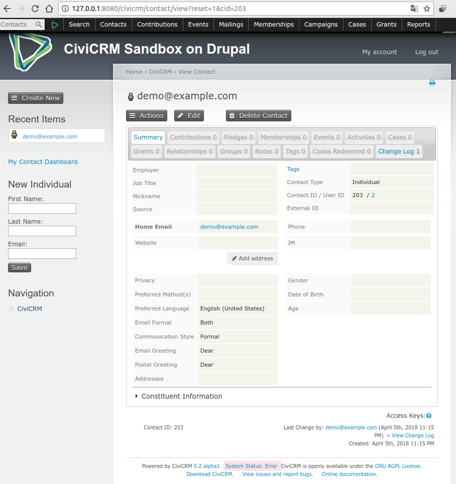
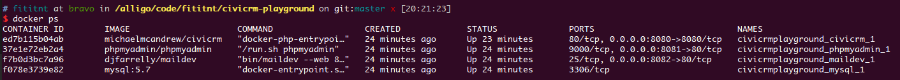
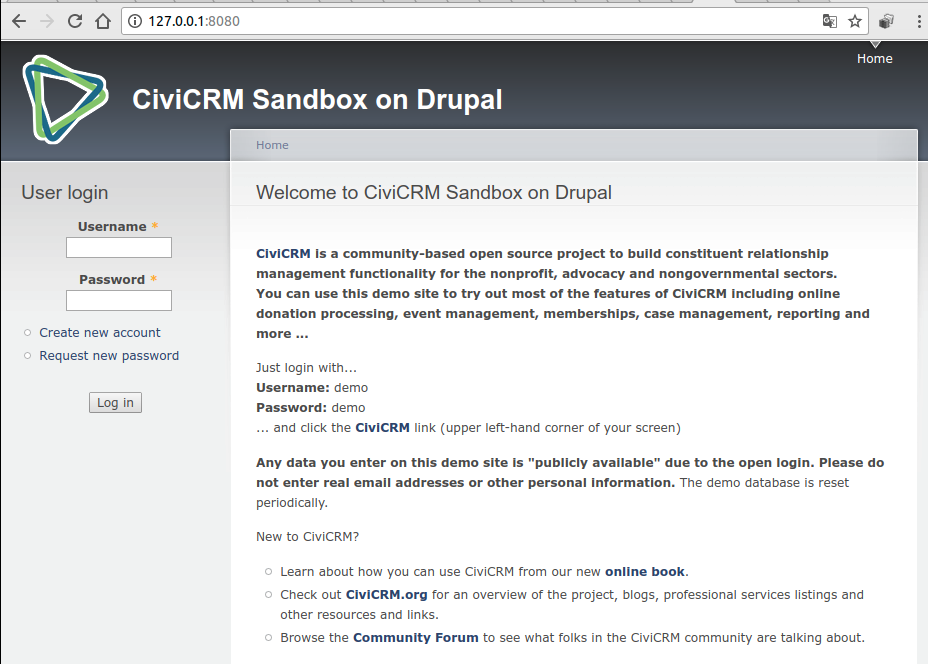
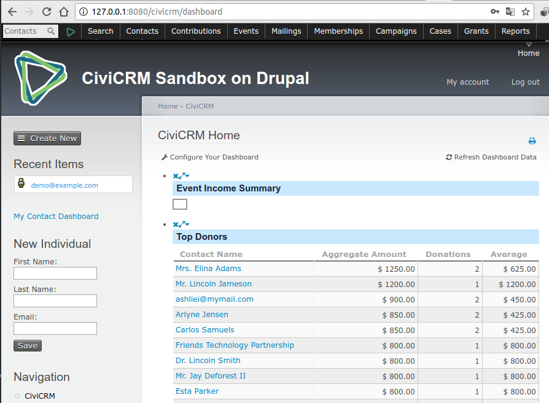

# CiviCRM Playground
Rocha's playgrond for CiviCRM (Open source Customer Relationship Management).
See [chatops-wg#33](https://github.com/fititnt/chatops-wg/issues/33) and
the [ChatOps for non-DevOps people Working Group 2018/01](https://github.com/fititnt/chatops-wg).

- Website: <https://civicrm.org/>
- GitHub: <https://github.com/civicrm/civicrm-core>
- Containers: <https://github.com/michaelmcandrew/civicrm-buildkit-docker>



## Logbook 


```bash

## Add all files (except the README.md from https://github.com/michaelmcandrew/civicrm-buildkit-docker)

docker-compose up -d

# Wait... 10min+

docker-compose exec -u buildkit civicrm civibuild create dmaster --url http://localhost:8080

# Wait... 10min+

## Open http://localhost:8080 on your browser


### Stop and clean all resources (DO NOT RUN `docker-compose down --volumes --rmi all` ON PRODUCTION)
docker-compose down --volumes --rmi all

```

See [fulllogs.sh](fulllogs.sh).

## Screenshots






## Enviroment

```
## Ubuntu 16.04.4 LTS
# Requires Need docker and docker-compose. Used:

$ docker -v
Docker version 17.12.1-ce, build 7390fc6

$ docker-compose -v
docker-compose version 1.18.0, build 8dd22a9
```